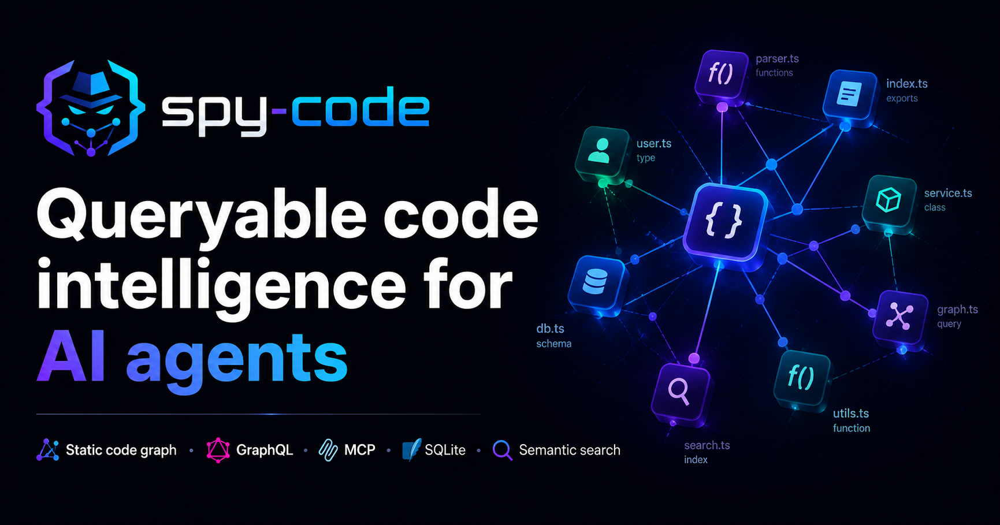
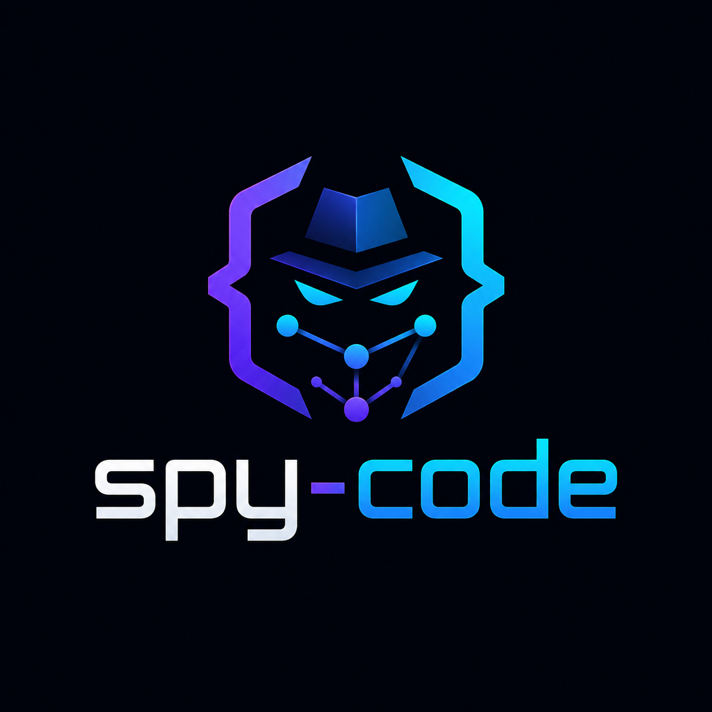
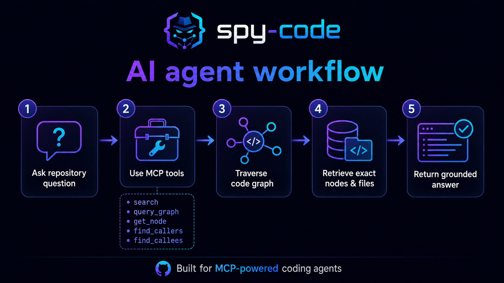
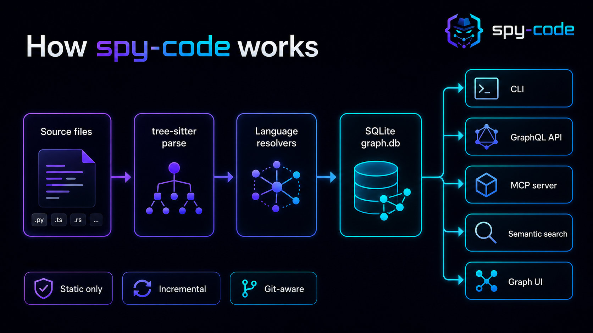
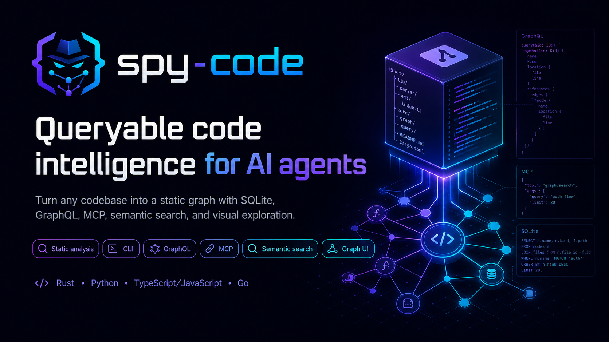

<p align="center">
  
</p>

<p align="center">
  
</p>

# spy-code

**Queryable code intelligence for AI agents.**

Turn any repository into a static, queryable code graph so coding agents can retrieve the exact symbols, callers, callees, imports, references, changed files, and semantic matches they need without stuffing whole files into the prompt.

`spy-code` is built for AI coding agents, MCP clients, codebase RAG systems, repository search, onboarding, architecture exploration, and review automation.

<p align="center">
  <a href="https://github.com/Psyborgs-git/spy-code"></a>
  
  
  
  
  
  
</p>

---

## What is spy-code?

`spy-code` is a static code intelligence engine for agents and developer tools.

It parses your codebase with tree-sitter, extracts functions, classes, constants, calls, imports, and references, stores them in a local SQLite database, and exposes the graph through:

- CLI commands
- GraphQL API
- MCP server for AI agents
- semantic search
- graph visualization

The goal is simple: give coding agents **smaller, sharper, dependency-aware context** before they edit code.

---

## Why coding agents need this

Most AI coding failures are not reasoning failures. They are context failures.

Agents often fall into this loop:

1. Fix bug A.
2. Break dependent behavior B.
3. Patch B.
4. Break A again.
5. Repeat until the repo is worse than before.

That happens because the agent sees a local snippet, not the system around it. It does not reliably know who calls a function, what the function calls, what imports matter, what references will be affected, or what changed since the last edit.

`spy-code` gives the agent a code graph before it acts.

Instead of guessing from fuzzy file search, the agent can ask:

- "Where is this symbol defined?"
- "Who calls this function?"
- "What does this function call?"
- "What changed since HEAD~5?"
- "Which nodes mention authentication?"
- "Give me the exact node, signature, doc comment, file, and line range."
- "Walk two hops up and down the call graph before editing."

That is the difference between patching blindly and patching with dependency context.

---

## Token-efficient context for coding agents

LLMs do not need your whole repository in context. They need the right slice.

`spy-code` helps agents avoid token waste by turning a repo into a persistent local index. The agent can retrieve small, structured answers instead of repeatedly pasting large files, grep output, or entire folders into the prompt.

| Instead of sending the agent... | Let it fetch from spy-code... |
|---|---|
| Entire source files | one exact node with name, kind, signature, docs, file path, and line range |
| Repeated grep dumps | ranked symbol search from names and descriptions |
| A whole module tree | callers, callees, imports, and references |
| All changed files | nodes changed since a Git ref |
| Long "remember this architecture" prompts | a local SQLite graph the agent can query repeatedly |
| Guesswork from similar names | stable node IDs like `src:auth.rs:_:login` |
| Prompt-heavy repo summaries | focused GraphQL or MCP tool responses |

This does not claim magic token compression. It gives agents a better retrieval layer so they can ask for narrow graph facts instead of carrying the repo around in the context window.

---

## Avoid the fix-one-break-one loop

<p align="center">
  
</p>

A safer agent workflow looks like this:

```text
1. Search for the feature or bug area.
2. Fetch the exact node.
3. Inspect callers.
4. Inspect callees.
5. Check changed nodes since the branch point.
6. Patch with dependency awareness.
7. Re-query the graph to verify the impacted neighborhood.
```

With MCP, the agent can run this workflow as tool calls:

| MCP tool | Why it matters for agents |
|---|---|
| `search` | Find likely symbols without dumping files |
| `get_node` | Fetch exact symbol context |
| `find_callers` | See upstream code that depends on the symbol |
| `find_callees` | See downstream behavior the symbol triggers |
| `changed_since` | Focus review on changed graph nodes |
| `query_graph` | Run deeper multi-hop GraphQL queries |
| `stats` | Check index state before relying on it |

This gives the agent a map of the blast radius before it edits.

---

## How it works

<p align="center">
  
</p>

`spy-code` indexes your repository into `.spy-code/graph.db`.

The pipeline:

```text
source files
  -> tree-sitter parse
  -> language resolvers
  -> nodes and edges
  -> SQLite graph database
  -> CLI, GraphQL, MCP, semantic search, graph UI
```

The graph stores:

| Object | Stored as |
|---|---|
| functions | nodes |
| classes | nodes |
| constants | nodes |
| calls | typed edges |
| imports | typed edges |
| references | typed edges |
| files | indexed file records |
| semantic vectors | SQLite embedding tables |
| Git state | last indexed SHA, changed files, rename metadata |

---

## Built for AI agents, not just humans

<p align="center">
  
</p>

`spy-code` is useful anywhere an agent or tool needs reliable codebase context:

- AI coding assistants
- MCP-powered IDE tools
- autonomous dev agents
- code review bots
- repository onboarding agents
- codebase RAG systems
- security and dependency analysis tools
- internal developer portals
- architecture discovery tools

It is static by design. No runtime tracing. No code execution. No production instrumentation. No full source-code storage in the graph.

---

## Install

### Python wrapper

```bash
pip install spy-code
```

The Python package wraps the native Rust binary and exposes the `spy-code` command.

### npm wrapper

```bash
npm install -g spy-code
```

The npm package exposes the `spy-code` command through its `bin` entry.

### From source

```bash
git clone https://github.com/Psyborgs-git/spy-code.git
cd spy-code
cargo build --release --package spy-cli
./target/release/spy-code --help
```

---

## Quick start

```bash
# 1. Create config
spy-code init

# 2. Index the current repository
spy-code index

# 3. Search by name or doc comment
spy-code search "auth"

# 4. Find callers and callees
spy-code callers src:auth.rs:_:login --depth 2
spy-code callees src:auth.rs:_:login --depth 2

# 5. Ask natural-language questions with embeddings
spy-code embed
spy-code ask "how do I authenticate users?"

# 6. Start GraphQL server and graph UI
spy-code serve --http
# Open http://localhost:4000/graph

# 7. Start MCP server for coding agents
spy-code serve --mcp
```

### Quick setup for AI coding environments

For automatic setup with Cursor, Windsurf, Claude Desktop, or GitHub Copilot:

```bash
# Run the auto-installer (from spy-code repository)
./scripts/install-spy-code-skill.sh
```

The auto-installer will:
- Detect your AI coding environment
- Install spy-code if needed
- Initialize configuration
- Index your codebase
- Configure MCP integration
- Verify the setup

For manual MCP configuration, see [docs/INTEGRATIONS.md](docs/INTEGRATIONS.md).

---

## CLI commands

```bash
spy-code init                            # Write default spy.config.json
spy-code index [--full] [--path .]       # Build/update graph; --full forces re-index
spy-code query '<graphql>' [--json]      # Run a GraphQL query against local DB
spy-code get <node_id>                   # Fetch one node
spy-code search <text> [--kind fn]       # Search names/descriptions
spy-code callers <node_id> [--depth N]   # Walk callers
spy-code callees <node_id> [--depth N]   # Walk callees
spy-code changed <git_ref>               # Nodes changed since Git ref
spy-code stats                           # Node/edge/file counts
spy-code embed [--full]                  # Generate semantic embeddings
spy-code ask "question"                  # Natural-language code search
spy-code graph [--path .] [--open]       # Open graph visualization
spy-code serve --mcp                     # MCP stdio server
spy-code serve --http [--port 4000]      # GraphQL HTTP server + graph UI
```

---

## Example: agent-safe code change workflow

Before editing a function:

```bash
spy-code search "login" --kind function
spy-code get src:auth.rs:_:login
spy-code callers src:auth.rs:_:login --depth 2
spy-code callees src:auth.rs:_:login --depth 2
```

After editing:

```bash
spy-code index
spy-code changed HEAD~1
spy-code callers src:auth.rs:_:login --depth 2
```

This lets an agent inspect affected code paths instead of editing only the first file it found.

---

## Example GraphQL query

```bash
spy-code query '{
  node(id: "src:auth.rs:_:login") {
    name
    description
    language
    filePath
    startLine
    endLine
    signatures {
      params { name type }
      returns
    }
    callers(limit: 10) {
      from { id name filePath }
      confidence
    }
    callees(limit: 10) {
      to { id name filePath }
      confidence
    }
  }
}'
```

---

## MCP tools for AI coding agents

Run:

```bash
spy-code serve --mcp
```

Then your MCP client can call:

| Tool | Use it for |
|---|---|
| `query_graph` | Complex multi-hop GraphQL queries |
| `get_node` | Fetch one node by stable node ID |
| `search` | Find symbols by rough name or description |
| `find_callers` | Find functions/methods that call a node |
| `find_callees` | Find functions/methods called by a node |
| `changed_since` | Find nodes changed since a Git ref |
| `stats` | Get index stats |

This turns `spy-code` into a local context server for AI coding agents.

---

## Graph model

### Nodes

A node represents a code entity:

- function
- class
- constant

Each node stores:

- stable `node_id`
- name
- kind
- language
- file path
- start and end line
- doc comment description
- signatures
- content hash
- Git SHA
- rename metadata

Example node IDs:

```text
src:lib.rs:_:parse
src:foo.rs:Bar:new
app/utils:db.py:DB:query
pkg:handler.go:_:Handle
```

### Edges

Edges represent code relationships:

- `calls`
- `imports`
- `references`

Edges include confidence values so ambiguous static resolution can still be represented safely.

---

## Semantic search

`spy-code` can generate vector embeddings for code nodes so users and agents can ask natural-language questions.

```bash
spy-code embed
spy-code ask "where is user authentication implemented?"
spy-code ask "what updates database records after checkout?"
spy-code ask "which code handles webhook validation?"
```

Use semantic search to find the entry point. Use the graph to verify exact dependencies.

---

## Git-aware incremental indexing

`spy-code` avoids unnecessary re-indexing.

It uses:

- per-file content hashes
- Git diff awareness
- last indexed commit metadata
- config hash tracking
- rename metadata

This helps agents stay focused on what changed, instead of re-reading the whole repository every time.

---

## Supported languages

| Language | Status | Parser strategy |
|---|---:|---|
| Rust | v1 | tree-sitter grammar + resolver |
| Python | v1 | tree-sitter grammar + resolver |
| TypeScript | v1 | tree-sitter grammar + resolver |
| JavaScript | v1 | tree-sitter grammar + resolver |
| Go | v1 | tree-sitter grammar + resolver |

---

## When to use spy-code

Use it when you want to:

- give an AI agent exact repository context
- reduce prompt bloat from full-file dumps
- inspect the blast radius before edits
- build a codebase RAG pipeline
- create a local code intelligence backend
- find dependency paths
- onboard engineers to unfamiliar repos
- review branch changes by graph nodes
- expose code graph tools through MCP
- query codebase structure through GraphQL

Do not use it for:

- runtime tracing
- production observability
- dynamic execution analysis
- mutation/write APIs
- full source-code storage

---

## Repository structure

```text
spy-code/
├── crates/
│   ├── spy-core         # types, node IDs, errors, traits
│   ├── spy-parser       # tree-sitter wrappers and AST walking
│   ├── spy-resolvers    # Rust, Python, TypeScript/JS, Go resolvers
│   ├── spy-storage      # SQLite schema, migrations, queries
│   ├── spy-graph        # GraphQL schema and resolvers
│   ├── spy-git          # Git diff and hash tracking
│   ├── spy-indexer      # parse -> resolve -> store orchestration
│   ├── spy-mcp          # MCP stdio server
│   ├── spy-embeddings   # vector embeddings and semantic search
│   └── spy-cli          # spy-code binary
└── docs/
```

---

## Documentation

- [`docs/INTEGRATIONS.md`](docs/INTEGRATIONS.md) - AI coding environment integration guide
- [`docs/MCP_SETUP.md`](docs/MCP_SETUP.md) - MCP server setup and configuration
- [`docs/AGENT_USAGE.md`](docs/AGENT_USAGE.md) - How agents should use spy-code
- [`docs/SKILL_REFERENCE.md`](docs/SKILL_REFERENCE.md) - Complete skill catalog
- [`docs/ARCHITECTURE.md`](docs/ARCHITECTURE.md) - system layout, crates, data flow
- [`docs/NODE_ID_SPEC.md`](docs/NODE_ID_SPEC.md) - node ID format and collision rules
- [`docs/SCHEMA.md`](docs/SCHEMA.md) - SQLite tables and GraphQL schema
- [`docs/RESOLVERS.md`](docs/RESOLVERS.md) - per-language resolver contract
- [`docs/CONFIG.md`](docs/CONFIG.md) - `spy.config.json` spec
- [`docs/CLI_MCP.md`](docs/CLI_MCP.md) - CLI commands and MCP tool surface
- [`docs/GIT_INTEGRATION.md`](docs/GIT_INTEGRATION.md) - change tracking
- [`docs/EMBEDDINGS.md`](docs/EMBEDDINGS.md) - semantic search and embeddings
- [`docs/ROADMAP.md`](docs/ROADMAP.md) - planned milestones
- [`docs/TESTING.md`](docs/TESTING.md) - test strategy

---

## GitHub SEO topics

Recommended repo topics:

```text
ai-agents
mcp
model-context-protocol
code-intelligence
static-analysis
code-search
graphql
sqlite
tree-sitter
repository-graph
code-graph
semantic-search
rag
developer-tools
rust
```

---

## Keywords

`code intelligence`, `AI coding agents`, `MCP server`, `Model Context Protocol`, `GraphQL code search`, `repository graph`, `codebase graph`, `static analysis`, `tree-sitter`, `SQLite code index`, `semantic code search`, `repository RAG`, `code graph`, `call graph`, `dependency graph`, `Rust CLI`, `developer tools`, `LLM code context`, `token efficient coding agent context`, `AI codebase understanding`.

---

## License

MIT
