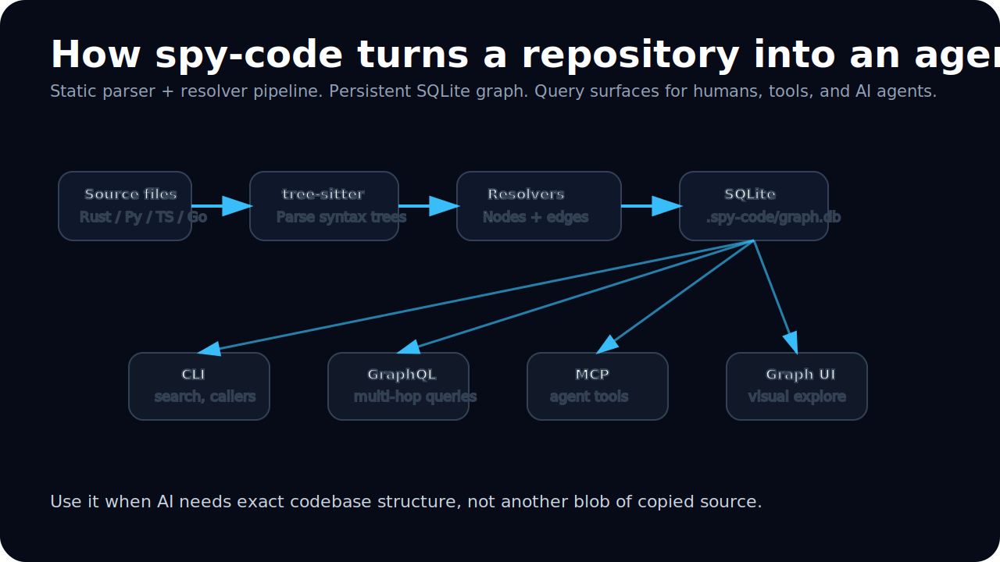

<p align="center">
  
</p>

# spy-code

**Turn any codebase into a queryable graph for AI agents, code search, onboarding, dependency analysis, and repository-level RAG.**

`spy-code` is a static code intelligence engine. It parses your repository with tree-sitter, extracts functions, classes, constants, calls, imports, and references, stores the result in SQLite, and exposes it through a CLI, GraphQL API, MCP server, semantic search, and visual graph UI.

It is built for developers and AI systems that need exact codebase context without executing the project or copying entire source files into prompts.

<p align="center">
  <a href="https://github.com/Psyborgs-git/spy-code"></a>
  
  
  
  
  
</p>

---

## Why spy-code exists

AI coding agents fail when they rely on fuzzy text search, stale snippets, or huge prompt dumps. They need structured facts:

- What functions, classes, and constants exist?
- Where is a symbol defined?
- Who calls this function?
- What does this module import?
- What changed since a Git ref?
- Which files and nodes are relevant to this natural-language question?

`spy-code` gives those answers as graph data.

---

## What it does

<p align="center">
  
</p>

`spy-code` indexes a repository into `.spy-code/graph.db` and creates:

| Capability | What it means |
|---|---|
| Static code graph | Functions, classes, constants, calls, imports, references |
| Stable node IDs | Path-based IDs like `dir:file:class:symbol` |
| SQLite storage | One local database per repo at `.spy-code/graph.db` |
| GraphQL API | Query the graph with `async-graphql` |
| MCP server | Give AI agents tool access over stdio |
| CLI commands | Search, inspect, traverse callers/callees, check stats |
| Incremental indexing | Skip unchanged files using content hashes and Git-aware updates |
| Semantic search | Generate embeddings and ask natural-language questions |
| Graph visualization | Explore code relationships visually in a browser |

---

## Built for AI agents

<p align="center">
  
</p>

Use `spy-code` when an AI agent needs repository context that is precise, structured, and cheap to retrieve.

Good fits:

- AI coding assistants
- MCP-powered developer tools
- Code review bots
- Architecture exploration agents
- Repository onboarding tools
- Codebase RAG pipelines
- Security and dependency analysis tools
- Internal developer portals

Bad fit:

- Runtime tracing
- Dynamic execution analysis
- Production observability
- Full source-code storage

`spy-code` is static by design.

---

## Supported languages

| Language | Status | Parser strategy |
|---|---:|---|
| Rust | v1 | tree-sitter grammar + resolver |
| Python | v1 | tree-sitter grammar + resolver |
| TypeScript | v1 | tree-sitter grammar + resolver |
| JavaScript | v1 | tree-sitter grammar + resolver |
| Go | v1 | tree-sitter grammar + resolver |

---

## Quick start

```bash
# 1. Create config
spy-code init

# 2. Index the current repository
spy-code index

# 3. Search by name or doc comment
spy-code search "auth"

# 4. Find callers and callees
spy-code callers src:auth.rs:_:login --depth 2
spy-code callees src:auth.rs:_:login --depth 2

# 5. Ask natural-language questions with embeddings
spy-code embed
spy-code ask "how do I authenticate users?"

# 6. Start GraphQL server and graph UI
spy-code serve --http
# Open http://localhost:4000/graph

# 7. Start MCP server for AI agents
spy-code serve --mcp
```

---

## CLI commands

```bash
spy-code init                            # Write default spy.config.json
spy-code index [--full] [--path .]       # Build/update graph; --full forces re-index
spy-code query '<graphql>' [--json]      # Run a GraphQL query against local DB
spy-code get <node_id>                   # Fetch one node
spy-code search <text> [--kind fn]       # Search names/descriptions
spy-code callers <node_id> [--depth N]   # Walk callers
spy-code callees <node_id> [--depth N]   # Walk callees
spy-code changed <git_ref>               # Nodes changed since Git ref
spy-code stats                           # Node/edge/file counts
spy-code embed [--full]                  # Generate semantic embeddings
spy-code ask "question"                  # Natural-language code search
spy-code graph [--path .] [--open]       # Open graph visualization
spy-code serve --mcp                     # MCP stdio server
spy-code serve --http [--port 4000]      # GraphQL HTTP server + graph UI
```

---

## Example GraphQL query

```bash
spy-code query '{
  node(id: "src:auth.rs:_:login") {
    name
    description
    language
    filePath
    startLine
    endLine
    signatures {
      params { name type }
      returns
    }
    callers(limit: 10) {
      from { id name filePath }
      confidence
    }
  }
}'
```

---

## MCP tools for AI agents

When you run:

```bash
spy-code serve --mcp
```

AI clients can call:

| MCP tool | Use it for |
|---|---|
| `query_graph` | Complex multi-hop GraphQL queries |
| `get_node` | Fetch one node by stable node ID |
| `search` | Find symbols by rough name or description |
| `find_callers` | Find functions/methods that call a node |
| `find_callees` | Find functions/methods called by a node |
| `changed_since` | Find nodes changed since a Git ref |
| `stats` | Get index stats |

This makes `spy-code` useful as a local context provider for coding agents.

---

## Graph model

`spy-code` stores nodes and typed edges.

### Nodes

A node represents a code entity:

- function
- class
- constant

Each node stores:

- `node_id`
- `name`
- `kind`
- `language`
- `file_path`
- `start_line`
- `end_line`
- `description` from doc comments
- signatures with params and returns
- content hash
- Git SHA
- rename metadata

### Edges

An edge represents a code relationship:

- `calls`
- `imports`
- `references`

Edges include confidence values so ambiguous static resolution can still be represented safely.

---

## Semantic search

`spy-code` can generate vector embeddings for code nodes so users and agents can ask natural-language questions.

```bash
spy-code embed
spy-code ask "where is user authentication implemented?"
spy-code ask "what updates database records after checkout?"
spy-code ask "which code handles webhook validation?"
```

Embeddings are stored in SQLite alongside the graph.

---

## Git-aware incremental indexing

`spy-code` avoids re-indexing unchanged code.

It uses:

- per-file content hashes
- Git diff awareness
- last indexed commit metadata
- config hash tracking

This makes it practical to keep a local code intelligence graph up to date as a repository changes.

---

## Configuration

`spy-code init` creates `spy.config.json`.

Example:

```json
{
  "version": 1,
  "db_path": ".spy-code/graph.db",
  "languages": {
    "rust": { "enabled": true, "roots": ["src/", "crates/"] },
    "python": { "enabled": true, "roots": ["./"] },
    "typescript": { "enabled": true, "roots": ["src/", "app/"] },
    "go": { "enabled": true, "roots": ["./"] }
  },
  "git": {
    "enabled": true,
    "track_renames": true,
    "follow_symlinks": false
  },
  "indexing": {
    "max_file_size_kb": 2048,
    "parallelism": "auto",
    "fail_fast": false
  }
}
```

---

## Common use cases

### Give an AI agent exact repository context

Instead of sending thousands of source lines to a model, expose MCP tools and let the agent request only the nodes and edges it needs.

### Find dependency paths

Use callers and callees to understand how a function connects to the rest of the codebase.

### Onboard to an unfamiliar repo

Run `spy-code graph --open` and inspect high-level relationships visually.

### Review code changes

Use `spy-code changed HEAD~5` to identify changed nodes since a branch point or recent commit.

### Build internal code search

Use the GraphQL API or SQLite database as a structured backend for repository search, architecture tools, or developer portals.

---

## Repository structure

```text
spy-code/
├── crates/
│   ├── spy-core         # types, node IDs, errors, traits
│   ├── spy-parser       # tree-sitter wrappers and AST walking
│   ├── spy-resolvers    # Rust, Python, TypeScript/JS, Go resolvers
│   ├── spy-storage      # SQLite schema, migrations, queries
│   ├── spy-graph        # GraphQL schema and resolvers
│   ├── spy-git          # Git diff and hash tracking
│   ├── spy-indexer      # parse → resolve → store orchestration
│   ├── spy-mcp          # MCP stdio server
│   ├── spy-embeddings   # vector embeddings and semantic search
│   └── spy-cli          # spy-code binary
└── docs/
```

---

## Documentation

- [`docs/ARCHITECTURE.md`](docs/ARCHITECTURE.md) — system layout, crates, data flow
- [`docs/NODE_ID_SPEC.md`](docs/NODE_ID_SPEC.md) — node ID format and collision rules
- [`docs/SCHEMA.md`](docs/SCHEMA.md) — SQLite tables and GraphQL schema
- [`docs/RESOLVERS.md`](docs/RESOLVERS.md) — per-language resolver contract
- [`docs/CONFIG.md`](docs/CONFIG.md) — `spy.config.json` spec
- [`docs/CLI_MCP.md`](docs/CLI_MCP.md) — CLI commands and MCP tool surface
- [`docs/GIT_INTEGRATION.md`](docs/GIT_INTEGRATION.md) — change tracking
- [`docs/EMBEDDINGS.md`](docs/EMBEDDINGS.md) — semantic search and embeddings
- [`docs/ROADMAP.md`](docs/ROADMAP.md) — planned milestones
- [`docs/TESTING.md`](docs/TESTING.md) — test strategy

---

## Keywords

`code intelligence`, `AI coding agents`, `MCP server`, `Model Context Protocol`, `GraphQL code search`, `repository graph`, `codebase graph`, `static analysis`, `tree-sitter`, `SQLite code index`, `semantic code search`, `repository RAG`, `code graph`, `call graph`, `dependency graph`, `Rust CLI`, `developer tools`, `LLM code context`.

---

## License

MIT